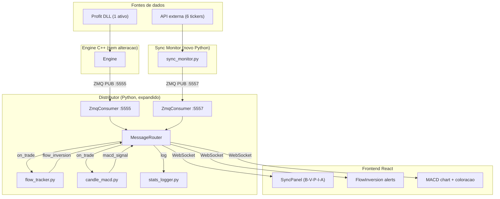

# Roadmap: servicos auxiliares sem sobrecarregar a engine

## Estado atual do codebase

- **Engine C++** ([engine/src/zmq_publisher.cpp](engine/src/zmq_publisher.cpp)): publica via ZMQ PUB `:5555` os tipos `trade`, `dom_snapshot`, `wall_add`, `wall_remove`, `daily` e `alert`. Cada `trade` ja inclui `buy_agent_name`, `sell_agent_name`, `buy_agent_short_name`, `sell_agent_short_name`, `qty`, `trade_type`, `price`, `vwap`, `net_aggression`.
- **Distributor Python** ([distributor/](distributor/)): 6 arquivos. `ZmqConsumer` conecta em `:5555`, coloca msgs numa `asyncio.Queue`, `MessageRouter.route()` valida JSON, aplica throttle em `dom_snapshot`, e faz `broadcast` via `ConnectionManager` para WS.
- **Frontend React** ([frontend/src/](frontend/src/)): Zustand store em [frontend/src/store/marketStore.ts](frontend/src/store/marketStore.ts), WebSocket hook em [frontend/src/hooks/useWebSocket.ts](frontend/src/hooks/useWebSocket.ts), types em [frontend/src/types/messages.ts](frontend/src/types/messages.ts).

## Visao geral da arquitetura




---

## Etapa 1 -- Sync Monitor (B-V-P-I-A + BOVA11)

### 1a. Novo servico `sync_monitor/` (Python standalone)

Criar pasta `sync_monitor/` na raiz do projeto com:

- `sync_monitor/main.py` -- processo standalone que roda em loop
- `sync_monitor/config.py` -- tickers (PETR4, VALE3, ITUB4, BBDC4, ABEV3, BOVA11), intervalo de polling (ex: 3s), banda 0.10%, porta ZMQ 5557
- `sync_monitor/price_fetcher.py` -- obtem ultimo preco dos 6 ativos via API externa (sugestao: `yfinance` ou endpoint B3 InfoMoney/StatusInvest); retorna dict `{ticker: price}`
- `sync_monitor/sync_calculator.py` -- calcula variacao % desde abertura; aplica regra dos 0.10% (todos dentro da banda = `in_sync: true`)
- `sync_monitor/requirements.txt` -- `pyzmq>=26.0.0`, `yfinance>=0.2.0` (ou lib de fetch escolhida)

Mensagem publicada no ZMQ PUB `:5557`:

```json
{
  "topic": "sync",
  "in_sync": true,
  "variations": {"PETR4": 0.05, "VALE3": -0.02, "ITUB4": 0.08, "BBDC4": -0.01, "ABEV3": 0.03, "BOVA11": 0.04},
  "ts": "2026-03-15T14:30:00.123Z"
}
```

### 1b. Distributor: segundo ZMQ SUB

Alterar o distributor para consumir de **duas** fontes ZMQ:

- [distributor/config.py](distributor/config.py): adicionar `ZMQ_SYNC_ADDRESS = "tcp://localhost:5557"`
- [distributor/main.py](distributor/main.py): instanciar um segundo `ZmqConsumer` no mesmo `queue` (a `asyncio.Queue` recebe msgs de ambos os consumers)
- [distributor/message_router.py](distributor/message_router.py): no `route()`, alem de `topic == "alert"` e `topic == "market"`, tratar `topic == "sync"` com broadcast direto (sem throttle)

### 1c. Frontend: painel de sincronia

- [frontend/src/types/messages.ts](frontend/src/types/messages.ts): adicionar `SyncMessage` interface e incluir no union `WsMessage`
- [frontend/src/hooks/useWebSocket.ts](frontend/src/hooks/useWebSocket.ts): no `handleMessage`, tratar `msg.topic === "sync"` chamando `store.updateSync(msg)`
- [frontend/src/store/marketStore.ts](frontend/src/store/marketStore.ts): adicionar estado `inSync: boolean`, `syncVariations: Record<string, number>`, e action `updateSync`
- Novo componente `frontend/src/components/SyncPanel/SyncPanel.tsx`: painel com 6 badges (B, V, P, I, A, BOVA11) mostrando variacao %, fundo cinza no app quando `!inSync`

---

## Etapa 2 -- Motor de fluxo (ranking e inversao)

### 2a. Modulo `flow_tracker.py` no distributor

Novo arquivo `distributor/flow_tracker.py`:

- Classe `FlowTracker` com:
  - `MONITORED_AGENTS`: lista configuravel de nomes (ex: `["UBS", "BTG", "GOLDM"]`)
  - `WINDOW_MS = 300_000` (5 min)
  - `_trade_log: deque[TradeEntry]` -- fila temporal de trades com `agent_name`, `qty`, `is_buy`, `ts`
  - `_prev_deltas: dict[str, int]` -- delta anterior por agente
  - Metodo `on_trade(msg: dict) -> list[dict]`:
    - Adiciona trade ao log, faz prune da janela
    - Para cada agente monitorado, calcula delta (compra agressiva - venda agressiva) nos ultimos 5 min
    - Se sinal mudou (pos->neg ou neg->pos), retorna msg `flow_inversion`
  - Usa `buy_agent_name`/`sell_agent_name` do trade (ja disponiveis) para identificar agentes

Mensagem gerada:

```json
{
  "topic": "market",
  "type": "flow_inversion",
  "agent_name": "UBS",
  "previous_delta": 120,
  "current_delta": -80,
  "ts": "..."
}
```

### 2b. Integracao no MessageRouter

Em [distributor/message_router.py](distributor/message_router.py), no `route()`:

- Ao receber `type == "trade"`, chamar `self._flow_tracker.on_trade(msg)` antes do broadcast
- Se retornar mensagens `flow_inversion`, fazer `broadcast` de cada uma

### 2c. Frontend: alertas de inversao

- [frontend/src/types/messages.ts](frontend/src/types/messages.ts): adicionar `FlowInversionMessage`
- [frontend/src/store/marketStore.ts](frontend/src/store/marketStore.ts): adicionar `flowInversions: FlowInversionMessage[]` e action
- Exibir como alertas no `AlertFeed` existente ([frontend/src/components/AlertFeed/AlertFeed.tsx](frontend/src/components/AlertFeed/AlertFeed.tsx)) ou em componente dedicado

---

## Etapa 3 -- MACD 30 min + coloracao

### 3a. Modulo `candle_macd.py` no distributor

Novo arquivo `distributor/candle_macd.py`:

- Classe `CandleMacd` com:
  - `PERIOD_MIN = 30`
  - `_candles: list[Candle]` (O, H, L, C, V por bucket de 30 min)
  - `_current_bucket: int` -- timestamp do bucket atual
  - Metodo `on_trade(msg: dict) -> Optional[dict]`:
    - Determina bucket 30 min do trade pelo `ts`
    - Se mesmo bucket, atualiza H/L/C/V
    - Se novo bucket, fecha candle anterior, calcula MACD (EMA 12, 26, signal 9) sobre closes, retorna msg `macd_signal`
  - Funcoes auxiliares: `_ema(values, period)`, `_calc_macd(closes)`

Mensagem gerada:

```json
{
  "topic": "market",
  "type": "macd_signal",
  "value": 12.5,
  "signal_line": 10.2,
  "histogram": 2.3,
  "direction": "buy",
  "candle_close": 125000,
  "ts": "..."
}
```

### 3b. Integracao no MessageRouter

Mesmo padrao: ao receber `trade`, chamar `self._candle_macd.on_trade(msg)`, broadcast se retornar `macd_signal`.

### 3c. Frontend: MACD com coloracao por sincronia

- [frontend/src/types/messages.ts](frontend/src/types/messages.ts): adicionar `MacdSignalMessage`
- [frontend/src/store/marketStore.ts](frontend/src/store/marketStore.ts): adicionar estado MACD (histogram, direction, candles)
- Novo componente `frontend/src/components/MacdChart/MacdChart.tsx`:
  - Barras do histograma: verde se `inSync && direction === "buy"`, vermelho se `inSync && direction === "sell"`, cinza se `!inSync`

---

## Etapa 4 -- Modulo estatistico

### 4a. Modulo `stats_logger.py` no distributor

Novo arquivo `distributor/stats_logger.py`:

- Classe `StatsLogger` com:
  - `_file_handle` -- CSV aberto em append
  - `_date` -- para rotacao diaria
  - Metodo `log(msg: dict)`: escreve linha CSV com campos padrao (ts, topic, type, ticker, price, qty, agent, rule, label, etc.)
  - Rotacao: se data mudou, fecha arquivo e abre novo
  - Diretorio de saida configuravel (ex: `distributor/logs/`)

### 4b. Integracao no MessageRouter

Em `route()`, apos broadcast, chamar `self._stats_logger.log(msg)` para `alert`, `trade`, `flow_inversion`.

---

## Resumo de arquivos

**Novos arquivos:**

- `sync_monitor/main.py`, `sync_monitor/config.py`, `sync_monitor/price_fetcher.py`, `sync_monitor/sync_calculator.py`, `sync_monitor/requirements.txt`
- `distributor/flow_tracker.py`, `distributor/candle_macd.py`, `distributor/stats_logger.py`
- `frontend/src/components/SyncPanel/SyncPanel.tsx`
- `frontend/src/components/MacdChart/MacdChart.tsx`

**Arquivos modificados:**

- `distributor/config.py` -- nova porta ZMQ 5557
- `distributor/main.py` -- segundo ZmqConsumer
- `distributor/message_router.py` -- route de sync, integracao flow/macd/stats
- `distributor/requirements.txt` -- (sem deps novas, pyzmq ja esta)
- `frontend/src/types/messages.ts` -- 3 novos tipos (SyncMessage, FlowInversionMessage, MacdSignalMessage)
- `frontend/src/hooks/useWebSocket.ts` -- handlers para novos tipos
- `frontend/src/store/marketStore.ts` -- novo estado sync, flow, macd
- `frontend/src/components/layout/AppLayout.tsx` -- incluir SyncPanel e MacdChart no layout

**Engine: ZERO alteracoes.**