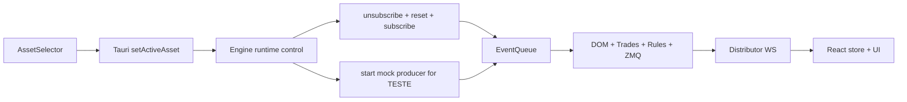

# Plano para Troca de Ativo e Ativo Mock

## Objetivo

Permitir que a seleção de ativo na interface altere de fato o ativo rastreado pela engine em tempo de execução, sem restart, e criar um ativo `TESTE` que produza dados mock dentro da engine para atravessar o mesmo fluxo `engine -> ZMQ -> distributor -> WebSocket -> frontend`.

## Estratégia

A implementação será dividida em dois fluxos complementares:

- Troca real de ativo em runtime: o frontend envia `ticker` e `exchange` para o backend desktop, que repassa um comando de controle para a engine; a engine faz `unsubscribe` do ativo atual, limpa estado interno, faz `subscribe` do novo ativo e continua publicando normalmente.
- Ativo `TESTE`: ao selecionar `TESTE`, a engine entra em um modo de feed sintético e injeta eventos internos (`TradeEvent`, `OfferBookEvent`, `DailyEvent`) na mesma fila já usada pelos callbacks da DLL.

## Mudanças principais

### 1. Criar um canal de controle runtime até a engine

Usar o app Tauri como ponte entre a interface e a engine.

Arquivos principais:

- [frontend/src/components/layout/AssetSelector.tsx](frontend/src/components/layout/AssetSelector.tsx)
- [frontend/src/store/marketStore.ts](frontend/src/store/marketStore.ts)
- [frontend/src/components/layout/StatusBar.tsx](frontend/src/components/layout/StatusBar.tsx)
- [app/src-tauri/src/commands.rs](app/src-tauri/src/commands.rs)
- [app/src-tauri/src/lib.rs](app/src-tauri/src/lib.rs)

Ações:

- Separar `selectedTicker` da UI do `streamingTicker` vindo do feed; hoje `activeTicker` é usado para os dois papéis.
- Fazer o `AssetSelector` chamar um novo comando Tauri, por exemplo `set_active_asset(ticker, exchange)`.
- Persistir a seleção em `AppConfig` para manter o ativo escolhido entre execuções.
- Expor o status da troca para a UI: `switching`, `active`, `error`.

### 2. Adicionar controle runtime na engine

A engine hoje só faz subscribe uma vez em [engine/src/main.cpp](engine/src/main.cpp); será necessário criar um loop/componente de controle para trocar o ativo em runtime.

Arquivos principais:

- [engine/src/main.cpp](engine/src/main.cpp)
- [engine/src/profit_bridge.h](engine/src/profit_bridge.h)
- [engine/src/profit_bridge.cpp](engine/src/profit_bridge.cpp)

Ações:

- Introduzir um componente de controle de ativo atual com operações:
  - `switch_to_real_asset(ticker, exchange)`
  - `switch_to_mock_asset()`
- Reusar as funções já existentes da DLL:
  - `SubscribeTicker`
  - `UnsubscribeTicker`
  - `SubscribeOfferBook`
  - `UnsubscribeOfferBook`
- Garantir ordem segura da troca:
  - parar/mock atual se existir
  - `unsubscribe` do ativo anterior
  - resetar estado interno
  - atualizar ticker ativo nos processadores
  - `subscribe` do novo ativo
- Padronizar resposta de sucesso/erro para o Tauri poder refletir isso na interface.

### 3. Resetar corretamente o estado single-ticker da engine

Hoje vários componentes assumem um único ticker fixo e acumulam estado. Sem reset, trocar de ativo misturará book, VWAP, agressão e alertas de ativos diferentes.

Arquivos principais:

- [engine/src/dom_snapshot.h](engine/src/dom_snapshot.h)
- [engine/src/dom_snapshot.cpp](engine/src/dom_snapshot.cpp)
- [engine/src/trade_stream.h](engine/src/trade_stream.h)
- [engine/src/trade_stream.cpp](engine/src/trade_stream.cpp)
- [engine/src/event_dispatcher.h](engine/src/event_dispatcher.h)
- [engine/src/event_dispatcher.cpp](engine/src/event_dispatcher.cpp)
- [engine/src/agent_ranking.h](engine/src/agent_ranking.h)
- [engine/src/rules/](engine/src/rules/)

Ações:

- Adicionar métodos explícitos de reset em DOM, trade stream, dispatcher e regras com estado.
- Chamar `AgentRanking::reset()` durante a troca.
- Garantir que snapshots e alertas antigos não sobrevivam à troca.
- Confirmar que o ticker usado por filtros internos passa a ser atualizável em runtime.

### 4. Implementar o ativo `TESTE` dentro da engine

Gerar dados mock no mesmo formato de eventos internos para preservar o pipeline real.

Arquivos principais:

- [engine/src/main.cpp](engine/src/main.cpp)
- [engine/src/event_bus.h](engine/src/event_bus.h)
- [engine/src/zmq_publisher.cpp](engine/src/zmq_publisher.cpp)
- novo arquivo sugerido: [engine/src/mock_feed.cpp](engine/src/mock_feed.cpp)
- novo arquivo sugerido: [engine/src/mock_feed.h](engine/src/mock_feed.h)

Ações:

- Criar um produtor mock em thread dedicada que injeta na `EventQueue`:
  - `DailyEvent` periódico para OHLC/volume
  - `OfferBookEvent` para montar e mover o book
  - `TradeEvent` para alimentar agressão, VWAP e alertas
- Definir o ticker do ativo mock como `TESTE` e exchange coerente, por exemplo `SIM`.
- Modelar um ciclo simples e previsível:
  - preço oscilando em torno de uma base
  - book com 5-10 níveis por lado
  - trades alternando compra/venda agressora
  - geração ocasional de paredes para exercitar `wall_add` / `wall_remove`
- Fazer a troca para `TESTE` desligar a assinatura da DLL e ligar apenas o mock producer.

### 5. Ajustar a interface para seleção e visualização coerentes

A UI precisa distinguir o ativo escolhido do ativo atualmente em streaming e oferecer o item `TESTE` na lista.

Arquivos principais:

- [frontend/src/components/layout/AssetSelector.tsx](frontend/src/components/layout/AssetSelector.tsx)
- [frontend/src/store/marketStore.ts](frontend/src/store/marketStore.ts)
- [frontend/src/hooks/useWebSocket.ts](frontend/src/hooks/useWebSocket.ts)
- [frontend/src/types/messages.ts](frontend/src/types/messages.ts)

Ações:

- Adicionar `TESTE` à lista de ativos disponíveis.
- Evitar que mensagens recebidas sobrescrevam a seleção do usuário como fonte de verdade da UI.
- Exibir o ticker realmente recebido do stream separadamente, se necessário, para debug.
- Manter compatibilidade com as mensagens já publicadas: `trade`, `dom_snapshot`, `wall_add`, `wall_remove`, `daily`.

### 6. Protocolo de controle e observabilidade

Para reduzir risco durante a mudança, incluir diagnóstico simples da troca de ativo.

Arquivos principais:

- [app/src-tauri/src/commands.rs](app/src-tauri/src/commands.rs)
- [engine/src/profit_bridge.cpp](engine/src/profit_bridge.cpp)
- [engine/src/main.cpp](engine/src/main.cpp)

Ações:

- Logar transições como:
  - ativo anterior -> novo ativo
  - unsubscribe OK/falha
  - reset OK
  - subscribe OK/falha
  - mock started/stopped
- Retornar ao frontend um resultado estruturado da troca.

## Critérios de validação

- Selecionar `PETR4`, `WINFUT` ou `WDOFUT` na interface faz a engine trocar o ativo em runtime, sem reinício do app.
- O frontend passa a exibir apenas dados do ativo recém-selecionado após a troca.
- Selecionar `TESTE` faz a interface receber dados contínuos mock pelos mesmos tipos de mensagem do pipeline real.
- VWAP, agressão, DOM, paredes e alertas continuam funcionando com `TESTE`.
- Voltar de `TESTE` para um ativo real desliga o mock e reativa a DLL corretamente.
- Não há vazamento de estado entre ativos após múltiplas trocas seguidas.

## Riscos principais

- Estado residual nas regras e agregadores ao trocar ticker.
- Corrida entre callbacks antigos da DLL e reset do novo ativo.
- Inconsistência entre seleção da UI e ticker efetivamente ativo se a troca falhar.

## Ordem recomendada de implementação

1. Separar seleção da UI do ticker do stream no frontend.
2. Criar comando Tauri para troca de ativo.
3. Implementar controle runtime na engine com unsubscribe/reset/subscribe.
4. Adicionar resets explícitos nos componentes stateful.
5. Implementar `TESTE` com mock feed na engine.
6. Validar alternância real <-> mock <-> real e revisar logs/erros.

