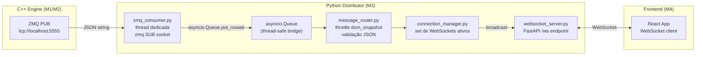

# M3 - Distribution Layer (Python)

## O que o M1/M2 entregam

Socket ZeroMQ PUB em `tcp://localhost:5555`. Duas categorias de mensagem (campo `topic`):

`**topic: "market"**` (dados brutos)

```json
{"topic":"market","type":"trade","ticker":"WINJ25","price":130000.0,"qty":5,
 "buy_agent":308,"sell_agent":72,"trade_type":2,"vwap":129850.0,
 "net_aggression":150,"ts":"2026-03-04T10:30:00.123Z"}

{"topic":"market","type":"wall_add","ticker":"WINJ25","price":130000.0,
 "qty":580,"side":1,"offer_id":1234567890,"agent_id":72,"ts":"..."}

{"topic":"market","type":"wall_remove","ticker":"WINJ25","offer_id":1234567890,
 "elapsed_ms":45,"was_traded":false,"ts":"..."}

{"topic":"market","type":"dom_snapshot","ticker":"WINJ25",
 "buy":[{"price":129950,"qty":320,"count":4}],
 "sell":[{"price":130050,"qty":580,"count":2}],"ts":"..."}
```

`**topic: "alert"**` (alertas das 5 regras)

```json
{"topic":"alert","rule":5,"ticker":"WINJ25","direction":"buy","conviction":"high",
 "label":"Alta Convicção — Exaustão Vendedora","price":129500.0,
 "data":{"rsi":27.3,"confirming_rules":3},"ts":"..."}
```

---

## Estrutura de Arquivos

```
distributor/
├── requirements.txt          # fastapi, uvicorn, pyzmq
├── main.py                   # entry point: inicia ZMQ thread + uvicorn
├── config.py                 # ZMQ_ADDRESS, WS_PORT, throttle settings
├── zmq_consumer.py           # thread ZMQ SUB → asyncio.Queue
├── connection_manager.py     # gerencia set de WebSocket clients conectados
├── message_router.py         # filtragem, throttle do dom_snapshot, validação
└── websocket_server.py       # FastAPI app, endpoint /ws e /health
```

---

## Fluxo de Dados



---

## Componentes

### `config.py`

```python
ZMQ_ADDRESS          = "tcp://localhost:5555"
WS_PORT              = 8000
WS_HOST              = "127.0.0.1"       # apenas localhost (single machine)
DOM_THROTTLE_MS      = 100               # máx 10 dom_snapshots/s para o frontend
MARKET_QUEUE_MAXSIZE = 1000              # descarta se frontend não consumir
```

### `zmq_consumer.py`

- Socket `zmq.SUB`, `RCVTIMEO = 100ms` (evita bloquear shutdown)
- Subscribe em tópico vazio (recebe tudo)
- Loop em **thread dedicada** (ZMQ não é thread-safe com asyncio)
- Chama `asyncio.get_event_loop().call_soon_threadsafe(queue.put_nowait, msg)` para passar ao event loop

```python
class ZmqConsumer:
    def __init__(self, address: str, queue: asyncio.Queue): ...
    def start(self) -> None: ...   # inicia thread daemon
    def stop(self)  -> None: ...   # seta flag de parada
    def _run(self)  -> None: ...   # loop ZMQ com RCVTIMEO
```

### `message_router.py`

Responsável por:

1. **Deserialização + validação** do JSON (trata exceções silenciosamente)
2. **Throttle de `dom_snapshot`**: só repassa ao `ConnectionManager` se `now - last_dom_ts >= DOM_THROTTLE_MS`
3. **Prioridade**: alertas (`topic: "alert"`) nunca são throttled
4. Mensagens inválidas são descartadas com log de warning

```python
class MessageRouter:
    def __init__(self, manager: ConnectionManager, throttle_ms: int): ...
    async def route(self, raw: str) -> None: ...
    def _should_throttle(self, msg_type: str) -> bool: ...
```

### `connection_manager.py`

```python
class ConnectionManager:
    def __init__(self): 
        self.active: set[WebSocket] = set()

    async def connect(self, ws: WebSocket) -> None: ...
    def disconnect(self, ws: WebSocket) -> None: ...
    async def broadcast(self, message: str) -> None: ...
    # remove clientes com falha de envio silenciosamente
```

### `websocket_server.py`

```python
app = FastAPI()

@app.websocket("/ws")
async def ws_endpoint(websocket: WebSocket):
    await manager.connect(websocket)
    try:
        while True:
            await websocket.receive_text()  # mantém conexão viva (ignora input do cliente)
    except WebSocketDisconnect:
        manager.disconnect(websocket)

@app.get("/health")
async def health():
    return {"status": "ok", "clients": len(manager.active), "zmq": zmq_consumer.is_alive()}
```

### `main.py`

```python
async def consume_loop(queue: asyncio.Queue, router: MessageRouter):
    while True:
        msg = await queue.get()
        await router.route(msg)

if __name__ == "__main__":
    queue   = asyncio.Queue(maxsize=MARKET_QUEUE_MAXSIZE)
    manager = ConnectionManager()
    router  = MessageRouter(manager, DOM_THROTTLE_MS)
    consumer = ZmqConsumer(ZMQ_ADDRESS, queue)
    consumer.start()

    @app.on_event("startup")
    async def startup():
        asyncio.create_task(consume_loop(queue, router))

    uvicorn.run(app, host=WS_HOST, port=WS_PORT)
```

---

## Formato das Mensagens WebSocket para o Frontend

O distributor passa as mensagens **sem alterar o JSON** do engine, garantindo contrato único.

O frontend identifica o tipo pelo campo `topic`:

- `"alert"` → card no Feed Tático (cor por `conviction`)
- `"market"` + `type: "trade"` → atualização do Painel de Agressão
- `"market"` + `type: "dom_snapshot"` → atualização do Heatmap
- `"market"` + `type: "wall_add/remove"` → marcações no Heatmap

---

## Reconexão e Resiliência

| Cenário                      | Comportamento                                     |
| ---------------------------- | ------------------------------------------------- |
| Engine C++ reinicia          | ZMQ SUB reconecta automaticamente (ZMQ gerencia)  |
| Frontend fecha aba           | `WebSocketDisconnect` → remove do `active set`    |
| Frontend reconecta           | Nova chamada `/ws` → `connect()`                  |
| dom_snapshot flood           | Throttle via `DOM_THROTTLE_MS` protege o frontend |
| Queue cheia (frontend lento) | `put_nowait` descarta mensagem, log warning       |

---

## `requirements.txt`

```
fastapi>=0.115.0
uvicorn[standard]>=0.30.0
pyzmq>=26.0.0
```
