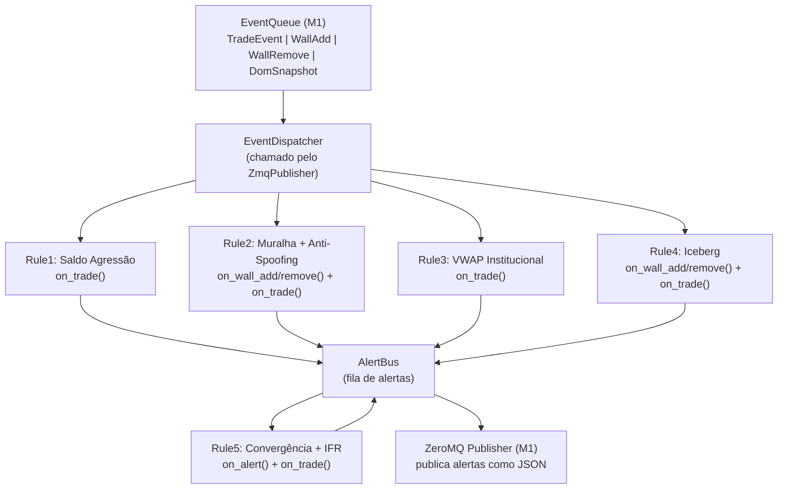

# M2 - Rule Engine (C++)

## O que o M1 entrega para o M2

Eventos disponíveis no `EventQueue` (já implementados):

- `TradeEvent` — price, qty, buy_agent, sell_agent, trade_type (2=compra agressão, 3=venda agressão), vwap_atual, net_aggression, AgentStats
- `WallAddEvent` — offer_id, price, qty, side, agent_id, timestamp_ms
- `WallRemoveEvent` — offer_id, price, elapsed_ms, was_traded
- `DomSnapshotEvent` — buy_side[], sell_side[] (PriceLevel com total_qty)

---

## Estrutura de Arquivos (adições ao `engine/`)

```
engine/src/
├── (M1: profit_bridge, dom_snapshot, trade_stream, event_bus, zmq_publisher, main, config)
├── alert_types.h            # struct Alert + enum Rule + enum Direction + enum Conviction
├── alert_bus.h/.cpp         # fila de alertas (separada do EventBus de dados de mercado)
├── event_dispatcher.h/.cpp  # despacha eventos enriquecidos para listeners registrados
├── rsi_calculator.h         # RSI Wilder, header-only
└── rules/
    ├── rule_base.h          # interface virtual: on_trade, on_wall_add, on_wall_remove, on_alert
    ├── rule1_aggression.h/.cpp
    ├── rule2_wall.h/.cpp
    ├── rule3_vwap.h/.cpp
    ├── rule4_iceberg.h/.cpp
    └── rule5_convergence.h/.cpp
```

---

## Fluxo de Dados M2



---

## Interfaces Base

`alert_types.h`:

```cpp
enum class Rule       { R1=1, R2=2, R3=3, R4=4, R5=5 };
enum class Direction  { Buy, Sell, Neutral };
enum class Conviction { Low, Medium, High };

struct Alert {
    Rule        rule;
    Direction   direction;
    Conviction  conviction;
    std::string label;        // ex: "Falso Rompimento de Topo"
    double      price;
    std::string ticker;
    nlohmann::json data;      // campos extras por regra
    int64_t     timestamp_ms;
};
```

`rule_base.h`:

```cpp
class RuleBase {
public:
    virtual void on_trade      (const TradeEvent&)       {}
    virtual void on_wall_add   (const WallAddEvent&)     {}
    virtual void on_wall_remove(const WallRemoveEvent&)  {}
    virtual void on_dom_snapshot(const DomSnapshotEvent&){}
    virtual void on_alert      (const Alert&)            {} // R5 usa isso
    virtual std::string_view name() const = 0;
    virtual ~RuleBase() = default;
protected:
    AlertBus& alert_bus_;
    explicit RuleBase(AlertBus& ab) : alert_bus_(ab) {}
};
```

---

## Regras Implementadas

### Regra 1 — Saldo de Agressão (Falso Rompimento)
- Buffer circular dos últimos 20 trades
- Dispara quando price_direction != aggression_direction AND |net_aggression| >= 200

### Regra 2 — Muralhas + Anti-Spoofing
- pending_walls com timer anti-spoofing
- Classificação: spoofing (descarta), absorção (Medium), resistiu (High)

### Regra 3 — VWAP Institucional
- VWAP incremental por agente
- Alerta quando desvio >= 0.1% e volume >= 500 lotes

### Regra 4 — Renovação / Iceberg
- recent_removals cache
- Iceberg confirmado (High) ou Renovação passiva (Medium)

### Regra 5 — Convergência + IFR
- RSI Wilder 14 períodos
- Alerta quando >= 2 regras convergentes + RSI overbought/oversold

---

## Formato das Mensagens ZeroMQ (alertas)

```json
{
  "topic":     "alert",
  "rule":      5,
  "ticker":    "WINJ25",
  "direction": "buy",
  "conviction":"high",
  "label":     "Alta Convicção — Exaustão Vendedora",
  "price":     129500.0,
  "data":      { ... campos específicos da regra },
  "ts":        "2026-03-04T10:30:00.123"
}
```
