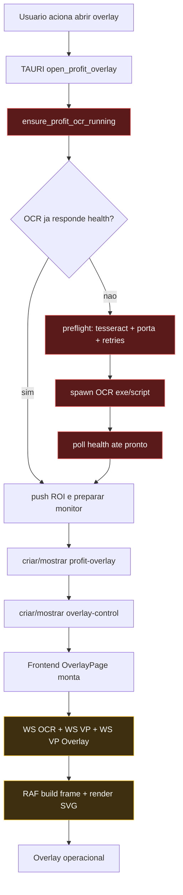

# Overlay do Profit - como funciona e por que demora para abrir

## Resumo executivo

O Overlay abre em duas fases sequenciais:

1. **Backend Tauri (`open_profit_overlay`)**: garante OCR no ar e cria/mostra as janelas transparentes.
2. **Frontend (`OverlayPage`)**: conecta WebSockets (OCR + mercado), monta frame visual e começa a renderizar.

O maior custo de abertura normalmente fica na fase 1, porque o comando de abertura **bloqueia** até o OCR responder healthcheck.

## Como a abertura funciona (fluxo real)

### 1) Disparo de abertura

- Abertura começa em `open_profit_overlay` no backend Tauri.
- Antes de exibir a janela, o backend chama `ensure_profit_ocr_running(...)`.
- Enquanto o OCR nao fica "healthy", a abertura nao conclui.

### 2) Garantia do OCR (gargalo principal)

`ensure_profit_ocr_running(...)` executa esta sequencia:

- Verifica se ja existe OCR respondendo HTTP.
- Se nao houver, faz preflight:
  - valida Tesseract no sistema;
  - testa porta OCR e tenta recuperar conflito;
  - pode executar `taskkill` de OCR orfao e esperar.
- Inicia `profit_ocr_service.exe` (ou script Python em dev).
- Faz polling de healthcheck ate ficar pronto.

Parametros que impactam diretamente a latencia:

- `OCR_HTTP_HEALTH_TIMEOUT_MS = 5000` (timeout por request de health)
- `OCR_POLL_INTERVAL_MS = 100`
- `PQ_OCR_STARTUP_TIMEOUT_MS` (default `120000` ms)
- Retry de porta ocupada: `10` tentativas com sleep de `400` ms

Conclusao: em primeira execucao (ou antivirus/IO lento), o OCR pode demorar varios segundos para bindar HTTP; nesse periodo a abertura da janela fica aguardando.

### 3) Criacao/mostra das janelas overlay

Depois de OCR pronto:

- mostra/cria `profit-overlay` (fullscreen transparente, always-on-top);
- mostra/cria `profit-overlay-control`;
- posiciona por monitor alvo;
- so entao `open_profit_overlay` conclui.

### 4) Bootstrap do frontend OverlayPage

Ao montar `OverlayPage`, o frontend:

- abre WS OCR (URL dinamica via `get_ocr_runtime_port`);
- abre WS de mercado (`/ws/volume-profile` e `/ws/vp-overlay`);
- carrega configuracoes (`read_config`);
- inicia loop RAF para montar frame (`safeBuildOverlayFrame`) e renderizar SVG.

Mesmo com janela visivel, pode parecer "lento" se os primeiros payloads chegarem em status:

- `connecting`
- `warming_up`
- `ocr_unreachable_retrying`

Isso indica aquecimento de OCR/feed e nao necessariamente travamento da UI.

## Porque demora para abrir (ordem de impacto)

1. **OCR bloqueia a abertura**  
   `open_profit_overlay` espera `ensure_profit_ocr_running` terminar antes de mostrar tudo.

2. **Cold start do OCR empacotado**  
   Primeira execucao de binario Python empacotado + carga de dependencias (OCR, captura de tela, FastAPI) aumenta tempo inicial.

3. **Antivirus/Defender no primeiro start**  
   Pode atrasar spawn e bind da porta local.

4. **Conflito/ocupacao de porta OCR**  
   Fluxo de recuperacao (probe + cleanup + retries) adiciona segundos extras.

5. **Aquecimento de leitura de eixo OCR**  
   O proprio servico usa janela de warm-up para estabilizar labels/eixo; visualmente, overlay pode ficar em estado transitorio no comeco.

6. **Triplo bootstrap de conexoes no frontend**  
   Sao 3 conexoes websocket + leitura de config logo no mount.

## Infografico (timeline de abertura)

## Checklist rapido de diagnostico de lentidao

- Verificar logs de latencia:
  - `ensure_profit_ocr_running ... elapsed_ms`
  - `open_profit_overlay windows_ready elapsed_ms`
  - `overlay_page_ws_open elapsed_ms`
- Se tempo alto antes de `windows_ready`, gargalo e backend/OCR.
- Se `windows_ready` rapido, mas sem dados, gargalo e WS/payload de OCR/mercado.
- Confirmar se ha fallback de porta OCR ou retries de health no bootstrap log.

